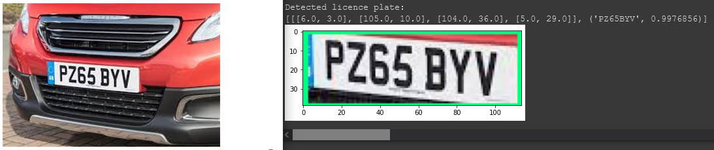

# Tensorflow ANPR

A simple project for the preparation, training, evaluation and implementation of an automatic number-plate recognition system  (ANPR) using Tensorflow and PaddleOCR.

# Requirements

This project was created and tested using Google Colab. If you want to run this on your local machine you'll have to use a Unix based system. For Windows systems, minor changes to the .ipynb file are required.

CUDA and cuDNN are required for GPU acceleration. Check out [this page](https://www.tensorflow.org/install?hl=en) for the correct version with respect to your Tensorflow installation.

A checkpoint for a pre-trained model (SSD MobileNet v2 320x320) is provided in the "models" folder. This model was trained using a *small* dataset for ~32k steps. Use this for testing only. If you want an accurate model you'll have to train it yourself with a bigger dataset. Steps are provided in the .ipynb file.

# Credits

Big thanks to the [official TensorFlow introduction](https://www.tensorflow.org/learn?hl=en) as well as [@nicknochnack](https://github.com/nicknochnack)'s free resources on Tensorflow.